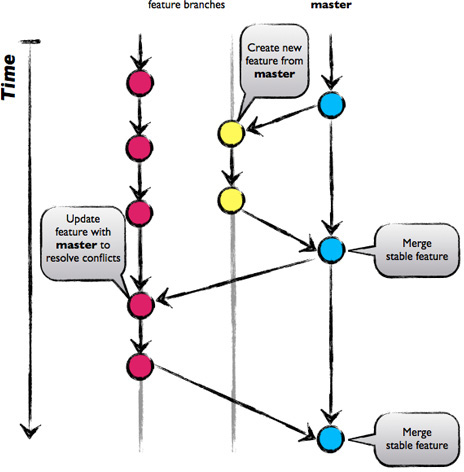

# Configuration

The `--global` flag saves the configuration in `~/.gitconfig`. Remove it to save the configuration in the `path/to/project/.git/config` file.

```sh
# identification details used when committing
git config --global user.name "Firstname Lastname"
git config --global user.email "your.email@provider.com"

# avoids merge commits when rebasing
git config --global pull.rebase true

# remove temporary files created by git when solving conflicts
git config --global mergetool.keepBackup false
```

# Feature branch workflow

The `master` branch is production branch, it contains the latest version of the code. It must always build, if the continuous integration breaks on master, it is the team priority to **fix it before any other merge or commit are made**. `Master` is also the base branch for developing **feature branches**.

A feature branch should:
* contain few modifications
* be short lived (no more than 1 week)
* fully tested
* merged only once

The workflow is as follow:



## Create a feature branch

* start from master (ensures it is fresh): `git checkout master; git pull --rebase`

* create the new branch (with your naming conventions, which can include an issue number) and push it to the remote repository:

```sh
git checkout -b 42-add-browser-notifications
# this first push can also be done when pushing your first commits
git push -u origin 42-add-browser-notifications
```

## Working on a feature branch

* code, commit and squash as you want on the branch
* `push --force` **ONLY if you are the only developer** working on the branch
* rebase from `master` regularly (daily):

```sh
git checkout master
git pull --rebase
git checkout 42-add-browser-notifications
git rebase master
# resolve conflicts if any
# validate (tests)
git push -f origin 42-add-browser-notifications
```
Rebasing `master` on the commits of your branch can become painful, particularly if you do it often and there are some conflicts
a long list of commits of your branch. To reduce the pain:
* squash the many commits of your branch (see § **Finish the feature branch**) and `push --force` this new commits history (ensure that other people working on the branch are not working on it, that you have the most recent state of the branch)
* force-update the commits history of other people working on the branch:

```sh
git checkout 42-add-browser-notifications
# loads the new commits history that was force-pushed
git fetch
# override your local history with the one that was force-pushed
git reset --hard origin/42-add-browser-notifications
```

## Finish the feature branch

* apply the validation rules set by the project team (test and code coverage, review process, etc.)
* rebase from `master` a last time
* [squash](https://www.atlassian.com/git/tutorials/rewriting-history#git-rebase-i) the branch commits into a single one (some online versionning environment like Gitlab or Bickbucket can do this for you when merging a branch)

```sh
# where <sha> is the commit id of the master branch from which you created the feature branch
git rebase -i <sha>

# - keep the first commit, then prefix all the others with the `s` flag
# - reword the message (with the branch name) of the single commit including all the modified code

# last push force
git push -f origin 42-add-browser-notifications
```

* merge the branch on `master`:

```sh
git checkout master
git merge 42-add-browser-notifications
git push
```

* optionally delete the feature branch locally and remotely

```sh
# deletes the branch locally. Use the `-D` flag to force the deletion (if it has not been merged yet for instance)
git branch -d 42-add-browser-notifications

# deletes the branch remotely
git push origin :42-add-browser-notifications
```

# Git bisect

Git bisect helps you identify a commit at which a feature has been broken for instance, by performing a dichotomic series of checkout between a "bad commit" (a commit at which the feature is broken) and a "good commit" (a commit at which the feature works).

```bash
git bisect start {bad commit} {good commit}
# validates a commit corresponding to a good version
git bisect good
# invalidates a commit corresponding to a bad version
git bisect bad
# skips a broken commit from the bisect process (eg. a work-in-progress commit at which the application does not run at all)
git bisect skip

# git bisect iteratively checkouts at another commit and eventually tells you the commit at which the feature was broken

# ends the bisect process by checkouting the HEAD commit
git bisect reset
```

# Git merge tools

I use [P4Merge](https://www.perforce.com/downloads/visual-merge-tool) to handle the conflicts (when rebasing or merging):

* [download P4Merge](https://www.perforce.com/downloads/helix#product-10) and dezip it in `~/Apps`
* declares `P4Merge tools` in your `PATH` to let git know about this tool when it encounters a conflict, by adding these instructions in your `~/.profile` file:

```bash
# P4Merge Git merge tools (added on ...)
if [ -d "$HOME/Apps/p4v/bin" ] ; then
    PATH="$HOME/Apps/p4v/bin:$PATH"
fi
```
